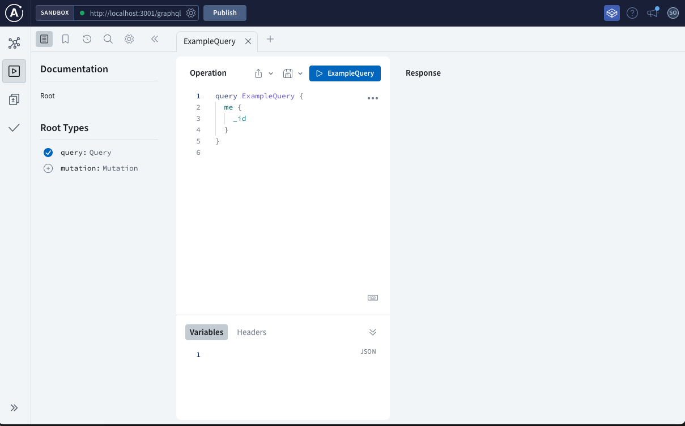

# Movie Lover - Server

## Description

This is the server side of the Movie Lover app. Please refer to the front end app for more info: [Movie Lover Front-End](https://github.com/faye3091/Project-3-client)

## Usage

## Installation

Run `npm i` to install dependencies.

Run `npm start` in the command line to start the server.

## Credits

[Vanessa Villaluz](https://github.com/faye3091)

[Kweku Adrkwa](https://github.com/1kweku)

[JuanCarlos Roa Jr.](https://github.com/Jcroa25)

[Sophia Marousis](https://github.com/marousiss)

## License

Please refer to the LICENCE in the repo